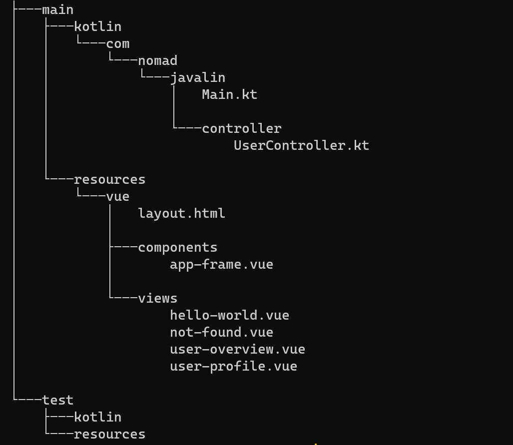

# javalin-vue-kotlin

## Build
gradle clean build

## Run
gradle clean installDist
.\build\install\javalinevuekot\bin\javalinevuekot

## Endpoints

http://localhost:7000

http://localhost:7000/users

http://localhost:7000/users/1

## File Structure:

